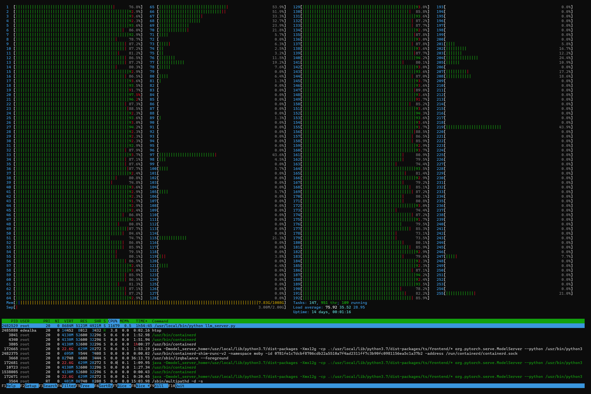

# LLM CPU Server

## Introduction

This repository contains code for running a Flask server for text generation using GGUF-based LLMs or any other compatible language models for the CPU.

## Quick Start
Clone the codebase:
```sh
git clone https://github.com/enrique-dealba/cpu-llm.git
```

Download LLM and move model weights to be in the `cpu_llm` directory. In our testing we downloaded quantized models using `https://lmstudio.ai/` and we tested CPU usage with `mistral-7b-instruct-v0.1.Q5_K_M.gguf` (note: this is a 5-bit quantized model, ~5.13GB).

## CPU Performance Metrics

Below is a comparison of performance metrics across different CPU configurations for the `mistral-7b-instruct-v0.1.Q5_K_M` model using Flask and FastAPI servers `llm_server.py` and `fastapi_server.py`.

| | **CPUs** | **16** | **32** | **64** | **128** | **192** | **MAX** |
| --- | --- | --- | --- | --- | --- | --- | --- |
| *Flask Server* | | | | | | | |
| *mistral-7b-instruct-v0.1.Q5_K_M* | TPS (tokens/s) | 0.46 | 1.32 | 3.35 | 7.46 | 7.31 | 7.36 |
| | Total time (s) | 559.3 | 178.9 | 73.72 | 37.13 | 34.76 | 35.07 |
| **FastAPI Server** | | | | | | | |
| **mistral-7b-instruct-v0.1.Q5_K_M** | TPS (tokens/s) | 0.51 | 1.28 | 3.57 | 7.56 | 7.29 | 7.59 |
| | Total time (s) | 484.68 | 208.17 | 67.52 | 33.22 | 36.50 | 28.35 |

These tests were conducted by running `benchmarks.py` and running a handful of prompts through the LLM Flask server and timing their responses. Note: A useful 'rule of thumb' is that in standard English text, one token is approximately equivalent to 4 letters. This means that 100 tokens are close to 75 English words.

## CPU Usage
Here's a screenshot that shows an example of the CPU performance in `htop`, with most cores nearing full utilization when running `mistral-7b-instruct-v0.1.Q5_K_M` at `MAX` CPUs:


## Docker

### Dockerfile Changes

If you need to use a different path for the model weights (e.g., `mistral-7b-instruct-v0.1.Q5_K_M.gguf`), you can easily change the relevant lines in the Dockerfile and `config.py``.

1. Modify COPY Command: Update the source path of the model weights in the Dockerfile:
```Dockerfile
COPY [Your-Model-Path] /app/mistral-7b-instruct-v0.1.Q5_K_M.gguf
```

2. Update MODEL_PATH: In `config.py`, change MODEL_PATH to the new path:
```python
MODEL_PATH = "[Your-Model-Path]"
```
Note: Replace [Your-Model-Path] with the actual path to your model weights.


### Running Docker Image
To build the Flask image:
```sh
docker build -f Dockerfile.flask -t llm-server .
```
Alternatively, to build the FastAPI image:
```sh
docker build -f Dockerfile.fastapi -t llm-server .
```
```sh
docker run -p 8888:8888 llm-server
```

### Run Docker with Different CPU Settings:
* Using --cpus:
This option allows you to specify the number of CPUs in fractional values. For example, to run the container with 32 CPUs:
```sh
docker run -p 8888:8888 --cpus="32" llm-server
```
